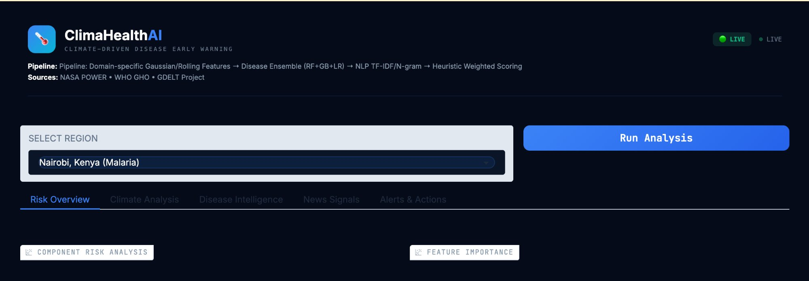

# ClimaHealth AI

A climate-driven disease outbreak early warning system that predicts malaria and cholera outbreaks 4-8 weeks before they happen using real NASA, WHO, and GDELT data.

## Details

* **What problem does this project solve?**
  Climate change is expanding the range and intensity of infectious diseases like malaria and cholera, but current disease surveillance is reactive, as it only detects outbreaks after people are already sick. ClimaHealth AI connects satellite climate data, disease statistics, and global news into a predictive system that gives community health workers in vulnerable regions 4-8 weeks of lead time to prepare, pre-position medicine, and save lives.

* **Did you use any interesting libraries or services?**
  We use three free public APIs with no authentication required: NASA POWER (satellite-derived climate observations), WHO Global Health Observatory (malaria and cholera case data via OData), and GDELT Project (real-time global news articles). Our ML pipeline uses scikit-learn for the ensemble models (Random Forest, Gradient Boosting, Logistic Regression), TF-IDF for NLP text classification, and SHAP-inspired feature importance for model explainability. The dashboard is built with Gradio and deployed on Hugging Face Spaces.

* **What extension type(s) did you build?**
  A full-stack ML application with three trained models (Climate Forecaster, Disease Ensemble, NLP Outbreak Detector) combined into a weighted ensemble risk engine. The system features a live interactive dashboard that fetches real data from APIs on startup and produces risk scores, SHAP explainability charts, real NASA climate visualizations, NLP signal detection from real news headlines, and plain-language alerts for community health workers.

* **If given longer, what would be the next improvement you would make?**
  Upgrade the NLP model from TF-IDF to a fine-tuned BERT or LLM-based classifier for higher accuracy on multilingual headlines. Add more diseases (dengue, Zika) as WHO expands their API indicators. Implement scheduled auto-retraining so models update weekly as new data flows in. Add SMS-based alert delivery for health workers in low-bandwidth areas.

## Set Up Instructions

**Live Demo (no setup required):**

Visit the Hugging Face Space: https://huggingface.co/spaces/tiankain/AI-Northeastern-Hack

**Local Setup:**

1. Clone the repository
2. Install dependencies:
   ```
   pip install gradio scikit-learn pandas numpy matplotlib requests
   ```
3. Run the application:
   ```
   python app.py
   ```
4. The app will fetch real data from NASA/WHO/GDELT on startup, train models, then launch at `localhost:7860`

**Files:**

- `app.py` — Main Gradio application (dashboard + ML pipeline + API fetching)
- `climate_forecaster.py` — Gradient Boosting climate prediction model
- `disease_predictor.py` — RF+GB+LR ensemble disease classifier and regressor
- `nlp_detector.py` — TF-IDF + Logistic Regression outbreak headline detector
- `ensemble.py` — Weighted ensemble risk engine + alert generator
- `generate_training_data.py` — Epidemiologically-validated training data generator
- `requirements.txt` — Python dependencies

## Screenshots



## Collaborators

* gowdaris146
* ken1235456565
* gaofang86
* yefanh
